#Requirements

Design a "laser maze" type system composed out of 20 laser/detector pairs

* Green pointer lasers;
* Battery operated - 3.7V 18650 li-ion;
* More than 10h operation on a single charge;
* Wireless at 433MHz;
* Latency up to 5ms;
* Vibration tolerant sensor;
* Portable, easily reconfigurable
* Standard microphone stands should be used as a means to mount and configure lasers and sensors.

#Sensor design

To avoid false positives caused by vibration of the sensor or the laser, we decided to use a sensing area of 50mm in diameter. Sensor recepticle was cut out of diffusing plexiglass. We expected that laser light dissipation will be enough for the whole diffusor to glow. 

We've chosen TEMT6200FX01 phototransistor as a sensing element because of it's sensitivity to green light and wide angle. 

Test rig was designed in openscad and 3D printed. 

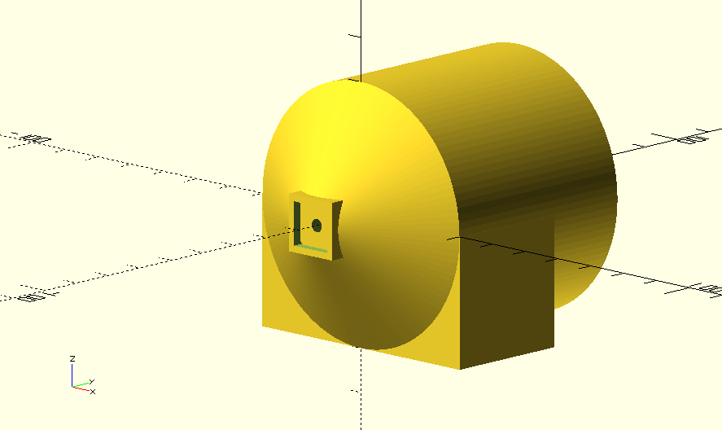
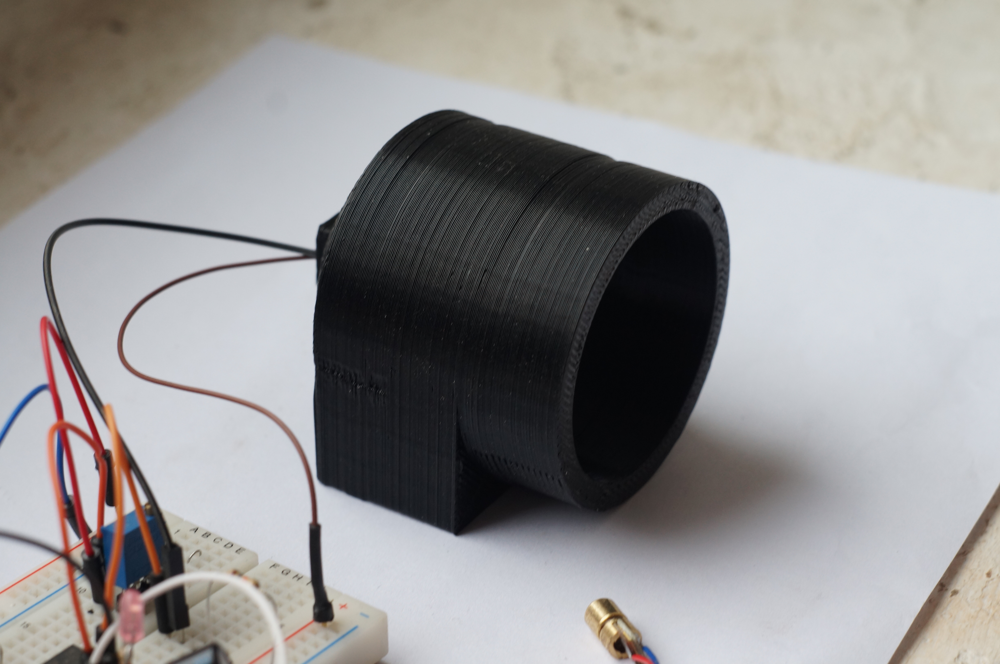

During testing it became clear that the plexiglass does not diffuse the laser light enough for single photo-transistor to detect uniformly over the whole area. Also, sensitivity of the sensor was too low - there is a tradeoff - higher the load resistor, higher the sensitivity, slower the response. We wanted to keep the response time of the sensor under 1ms, this limited the sensitivity we could achieve thus we had to use a comparator for beam break detection.  

Soon we have realised that a single photo-transistor won't work. So we have moved to 4 photottransistor grid.

This grid gave us pretty even signal over the whole are of the sensor, difference between illuminated and non illuminated reading being ~100mV using red pointer laser.

As ambient light influences the idle level of the sensor a lot, we needed means to perform a calibration. We have decided to use a digital potentiometer for that. This is how the first revision of detector circuit looked like:

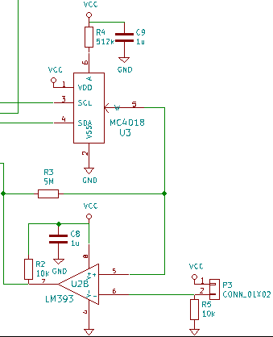

P3 is a connector for the photo-transistor matrix, R5 is a photo-transistor load resistor, U2B is the comparator that compares the detector matrix output to a value set by U3 and R4. U3 is a 100k digital potentiometer, allowing to set a reference voltage form 0V to 0.540V in 128 steps, one step being 4mV. R3 adds about 10mV of hysteresis.

Initially we used MICREL MIC5504 LDO voltage regulator, but it's load regulation proved to be inferior. This is what 3.3V rail looks like when the radio starts transmission:

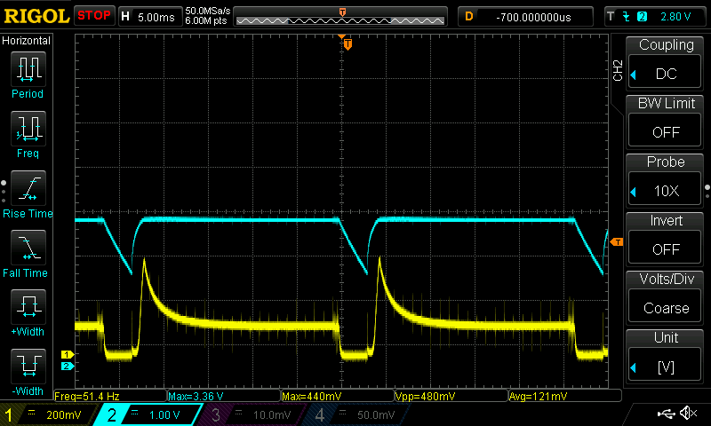

Blue trace is regulated 3.3V voltage rail, yellow trace is a phototransistor signal. 

TPS79333 from Texas Instruments performed much better:
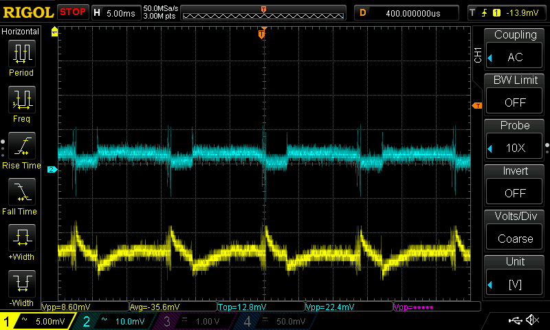

NCP700 from ON Semiconductor was a little worse than TI chip.

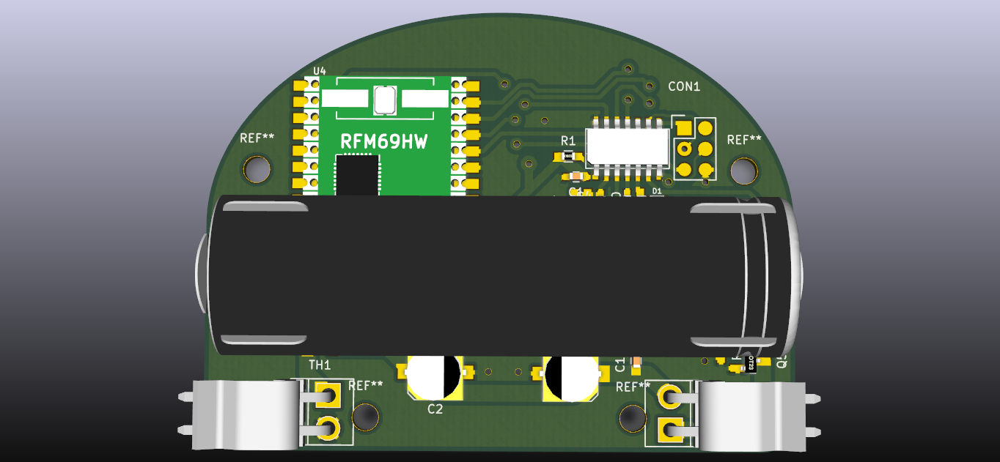

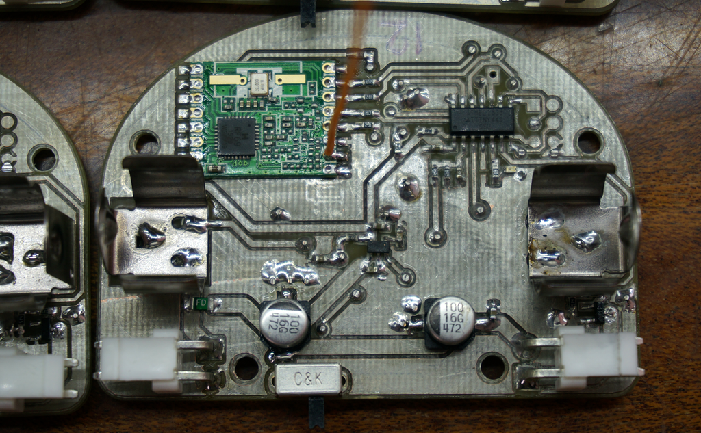

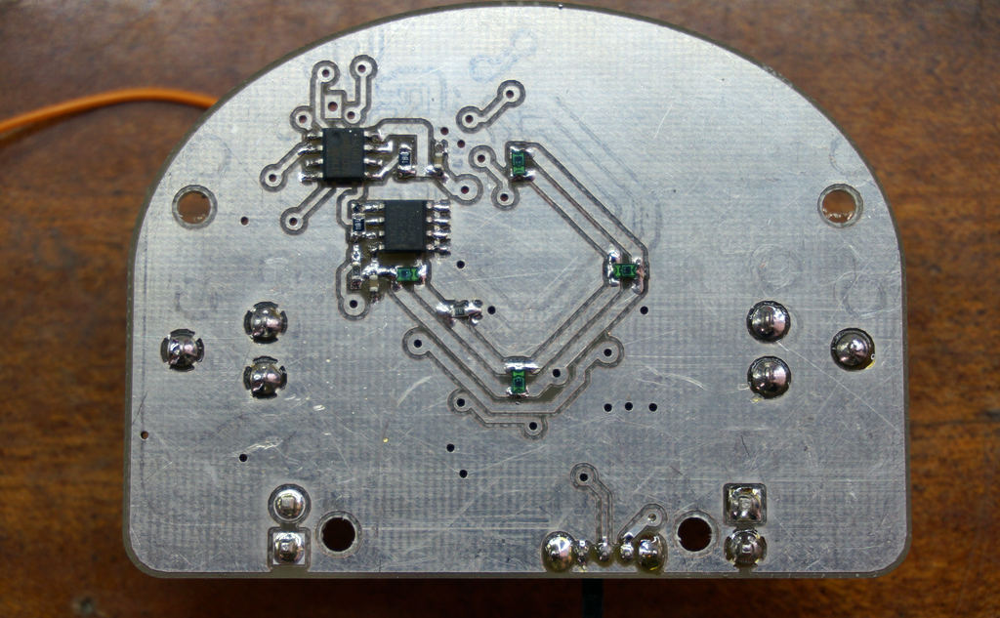

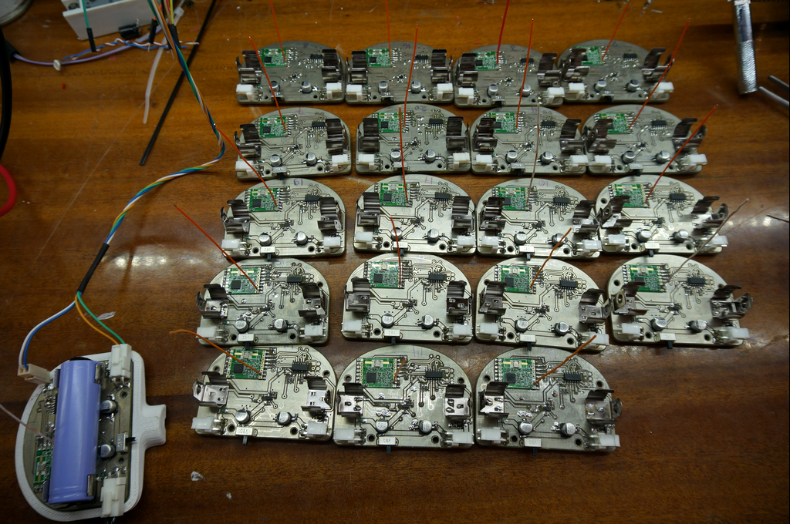

#Radio
We expected to use a cheap ebay 433MHz transmitter/receiver pair for radio communication, but at the first test it proved to be insufficient. The communication was unreliable and too slow at 4800 baud rate. So we decided to test RFM01/RFM02 pair by Hope electronics. 

The original idea was to have lasers as dumb always-on battery+laser assemblies, but after some thought we've decided that it would be a good thing to have means to switch off lasers too - it would prevent them from overheating, extend their life and create a possibility to play cool effects by switching and PWMing them. Thus, to keep price down we have decided to join the laser and sensor together in a single assembly, guiltying a bit against the the total wireless idea we had in the beginning by using a relatively short cable from the laser module to the main sensor/MCU board.

So, to have a two-directional communication possibility we have decided to test RFM69W modules - there's plenty of example code floating around on the net so we wouldn't have to reinvent the wheel. The test turned out to be ok, we were able to get reliable communication across the room and the latency was 3.16ms.

#Lasers

We have decided to use green laser pointers as a laser module source as it was the cheapest option. 

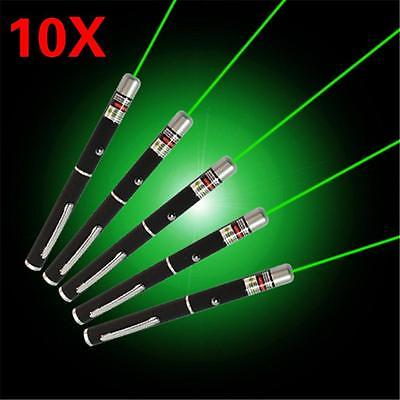

During the member day meetup event in the Technarium hackerspace we took some time to peel the aluminium case off the modules - some mental echo of ancient people sitting around the fire and peeling fruits. Modules proved to be of several kinds physically, but all of them used the same constant current driver circuit.

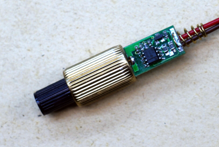

The laser modules have a simple constant current regulator attached to them. The pass transistor is controlled by the op-amp in such a way that voltage across the shunt resistor is equal to a voltage specified by the resistive divider reference for which is provided by 2.5V zener diode. Modules run at 330mA.

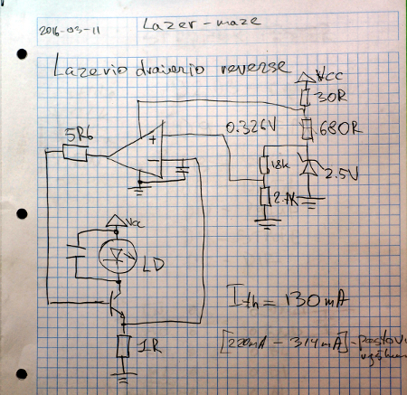

We have hooked up an external potentiometer instead of reference divider and performed some experiments. Lasing action starts around 130mA. The beam gets brighter while increasing the current up to 220mA, then stays fairly constant up to 310mA and then starts increasing again. The maximum we have tried was 350mA. The module was not overheating, so probably current can be increased more, but it's not clear where critical overcurrent point is for the particular laser diode. Diode characteristics drift a lot with temperature so it's not clever to run it on very high current without having feedback from the actual light output intensity. Flat region 220-310mA is interesting though - it might be a good idea to run in the middle of this region. 

As laser modules are reclaimed from a dubious source, they are probably some kind of production rejects as prices for the same modules are much much higher on ebay. As the driving circuit does not have an optical feedback, modules proved to be unstable with temperature - they would become dimm upon heating up. To mitigate the overall shonkiness of modules we have designed a huge heatsink for them.

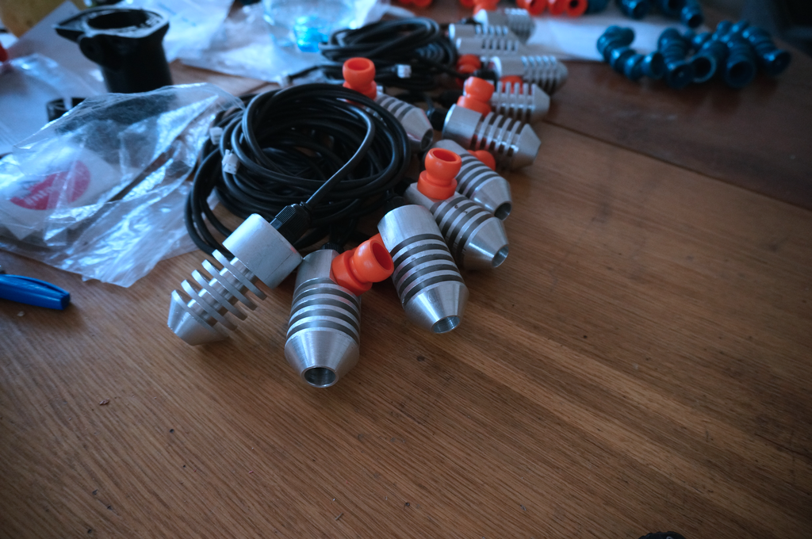

#Case design
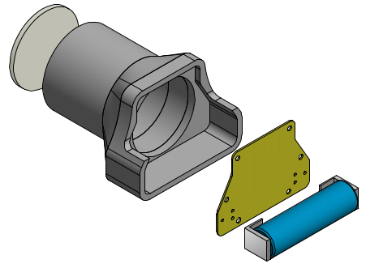
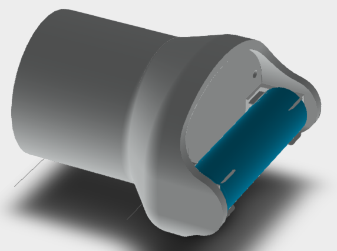
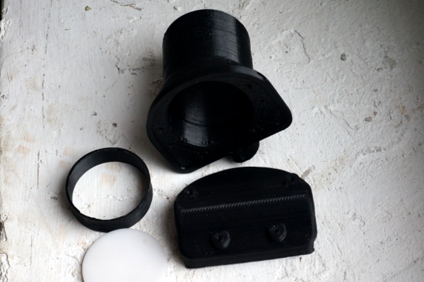
