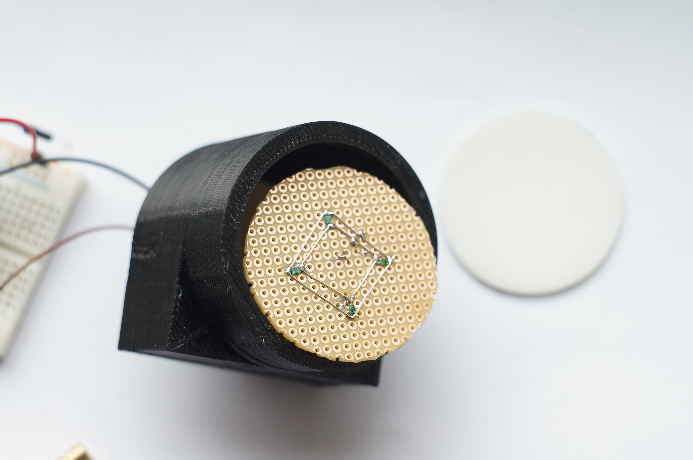

#Requirements

Design a "laser maze" type system composed out of 20 laser/detector pairs

* Green pointer lasers;
* Battery operated - 3.7V 18650 li-ion;
* More than 10h operation on single charge;
* Wireless at 433MHz;
* Latency up to 5ms;
* Vibration tolerant sensor;

#Sensor design

To avoid false positives caused by vibration of the sensor or the laser, we decided to use a sensing area of 50mm in diameter. Sensor recepticle was cut out of diffusing plexiglass. We expected that laser light dissipation will be enough for the whole diffusor to glow. 

We've chosen TEMT6200FX01 phototransistor as a sensing element because of it's sensitivity to green light and wide angle. 

Test rig was designed in openscad and 3D printed. 

During testing it became clear that the plexiglass does not diffuse the laser light enough for the sensor to detect uniformly over the whole area. Also, sensitivity of the sensor was too low - there is a tradeoff - higher the load resistor, higher the sensitivity, slower the response. We wanted to keep the response time of the sensor under 1ms, this limited the sensitivity we could achieve thus we had to use a comparator for beam break detection.  

Soon we have realised that a single sensor won't work. So we have moved to 4 sensor grid.

This grid gave us pretty even signal over the whole are af the sensor, difference between illuminated and non illuminated reading being ~100mV.